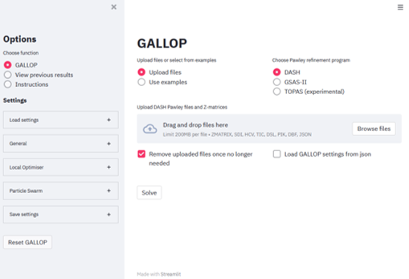

# **_GALLOP_**
**GPU Accelerated Local Optimisation and Particle Swarm: fast crystal structure determination from powder diffraction data.**

Contents:
1. [Introduction](#introduction)
2. [Try _GALLOP_](#try-_GALLOP_)
3. [Local Installation](#local-installation)
4. [References and Resources](#references-and-resources)

## **Introduction**

An article describing the approach taken by this code was submitted to CrystEngComm on 2021-07-26.

_GALLOP_ is a recently developed hybrid algorithm for crystal structure determination from powder diffraction data (SDPD), which combines fast local optimisation with a particle swarm optimiser. This repository provides an implementation of _GALLOP_ that is capable of running on graphics processing units (GPUs) and tensor processing units (TPUs*). The use of hardware accelerators provides significant performance advantages over CPU-based methods, allowing complex crystal structures to be solved rapidly.

Other software is required for PXRD data indexing and intensity extraction via Pawley refinement. _GALLOP_ currently accepts as input files produced by [_DASH_](https://www.ccdc.cam.ac.uk/solutions/csd-materials/components/dash/), [_GSAS-II_](https://subversion.xray.aps.anl.gov/trac/pyGSAS) and [_TOPAS_](http://www.topas-academic.net/) (experimental). Z-matrices of the molecular fragments of interest are also required.

Once all data is prepared, _GALLOP_ can be used via a convenient browser-based GUI or as part of a Python program.

\* instructions coming soon

------------------------------
## **Try _GALLOP_**
You will need a Google account to run the notebooks linked below. These notebooks will allow you to try _GALLOP_ for free, via your browser. You will not need to download or install anything to your computer, and do you not require local GPU hardware in order to run these notebooks.

| Notebook | Description |
|---------|--------|
|[Browser interface](https://colab.research.google.com/drive/1z84w8CMLj9xHhFYrDrL3B0O5aY0QAMRN?usp=sharing) | Try the _GALLOP_ browser interface *|
|[Python mode](https://colab.research.google.com/drive/1P4VHNtDGuxNztYP17CiIyhgwEHBHHbrL?usp=sharing) | Try _GALLOP_ as part of a Python program |

\* To use the browser interface notebook, you will also need an ngrok authentication key, which can be obtained for free [here](https://ngrok.com/).
### **PXRD Data preparation**
_GALLOP_ is able to read Pawley fitting output files produced by _DASH_, GSAS-II and TOPAS.

- _DASH_: follow the Pawley fitting procedure as normal, and ensure that the resultant ```.sdi, .dsl, .hcv, .pik``` and ```.tic``` files are available.

- GSAS-II: Pawley fit the data as normal. Once satisfied with the fit, unflag **all** parameters apart from the intensities (i.e. peak shape, unit cell, background etc should all be fixed). Reset the intensity values (via Pawley create), then ensure that for this final refinement, the optimisation algorithm is set to ```analytic Jacobian```. This is _essential_, as the default ```analytic Hessian``` optimiser modifies the covariance matrix in ways that produce errors in _GALLOP_. After saving, _GALLOP_ will read in the ```.gpx``` file.

- TOPAS (experimental): Pawley fit the data as normal. Once satisfied with the fit, unflag **all** refined parameters in the ```.inp``` (i.e. peak shape, unit cell, background etc should all be fixed), and delete the intensities (if present). Add the key word ```do_errors``` before the ```hkl_Is``` term, and add the key word ```C_matrix``` to the end of the ```.inp``` file. _GALLOP_ will read in the resultant ```.out``` file.

### **Z-matrices**
_GALLOP_ is able to read Z-matrices that have been produced by the ```MakeZmatrix.exe``` program that is bundled with _DASH_.

An example Z-matrix is below, showing the expected format. Lines 1-3 are ignored by _GALLOP_ (but should still be present in the file), line 4 onwards contains information about the atoms. The columns have the following format:

1. Element symbol
2. Bond length
3. Bond length refinement flag (1 = refine*)
4. Angle
5. Angle refinement flag (1 = refine*)
6. Torsion angle
7. Torsion angle refinement flag (1 = refine)
8. Atom index for bond
9. Atom index for angle
10. Atom index for torsion
11. Debye-Waller factor for atom
12. Occupancy of atom
13. Atom index in file used to generate Z-matrix
14. to 17. Atom labels in file used to generate Z-matrix. 14 = current atom, 15-17 linked to indices in columns 8-10. The index for an atom is equivalent to the zero-indexed order in which it appears in the Z-matrix, i.e. for a Z-matrix with _N_ atoms, the first atom in the ZM = index 0, the last atom in the ZM = index _N_-1.

\* refinement of bond lengths and angles in _GALLOP_ is not yet supported
```
Z-matrix generated by ToolKit
1.0 1.0 1.0 90.0 90.0 90.0
  35   0
  S      0.0000000  0     0.000000  0     0.000000  0    0    0    0  3.0  1.0    2 S2
  C      1.8177016  0     0.000000  0     0.000000  0    1    0    0  3.0  1.0   15 C3 S2
  C      1.8283979  0    99.579820  0     0.000000  0    1    2    0  3.0  1.0   16 C4 S2 C3
  C      1.5232339  0   109.911257  0  -170.684290  1    2    1    3  3.0  1.0   14 C2 C3 S2 C4
  H      0.9813685  0   109.693939  0   121.095906  0    2    1    4  6.0  1.0   27 H7 C3 S2 C2
  H      0.9572320  0   110.549365  0  -121.387389  0    2    1    4  6.0  1.0   28 H8 C3 S2 C2
  C      1.4927147  0   114.065887  0    62.653100  1    3    1    2  3.0  1.0   17 C5 C4 S2 C3
  H      0.9759911  0   100.970584  0   122.204015  0    3    1    7  6.0  1.0   29 H9 C4 S2 C5
  H      0.9855786  0   108.004016  0  -124.221958  0    3    1    7  6.0  1.0   30 H10 C4 S2 C5
  C      1.5152129  0   112.786930  0    67.443801  1    4    2    1  3.0  1.0   13 C1 C2 C3 S2
  H      0.9472479  0   110.310184  0  -122.665750  0    4    2   10  6.0  1.0   25 H5 C2 C3 C1
  H      0.9803862  0   108.741344  0   117.500021  0    4    2   10  6.0  1.0   26 H6 C2 C3 C1
  N      1.3817147  0   118.733461  0    56.911575  1    7    3    1  3.0  1.0    9 N4 C5 C4 S2
  C      1.3502925  0   125.467914  0   178.519478  0    7    3   13  3.0  1.0   18 C6 C5 C4 N4
  N      1.3219948  0   114.720410  0    51.385586  1   10    4    2  3.0  1.0    7 N2 C1 C2 C3
  N      1.3239387  0   116.701385  0   179.823818  0   10    4   15  3.0  1.0    8 N3 C1 C2 N2
  C      1.3159161  0   111.226477  0   178.885305  0   13    7    3  3.0  1.0   19 C7 N4 C5 C4
  S      1.7276900  0   110.235809  0  -177.494170  0   14    7    3  3.0  1.0    3 S3 C6 C5 C4
  H      0.8888039  0   127.959634  0  -179.218947  0   14    7   18  6.0  1.0   31 H11 C6 C5 S3
  S      1.6099792  0   124.015478  0   177.152771  0   15   10    4  3.0  1.0    1 S1 N2 C1 C2
  H      0.8407330  0   121.656021  0  -179.639174  0   16   10    4  6.0  1.0   23 H3 N3 C1 C2
  H      0.8916929  0   118.440482  0   177.399416  0   16   10   21  6.0  1.0   24 H4 N3 C1 H3
  N      1.3675353  0   128.791480  0   177.813567  0   17   13    7  3.0  1.0   10 N5 C7 N4 C5
  O      1.4401296  0   104.153339  0   176.990530  1   20   15   10  3.0  1.0    4 O1 S1 N2 C1
  O      1.4495729  0   111.428796  0   126.708421  0   20   15   24  3.0  1.0    5 O2 S1 N2 O1
  N      1.6102226  0   112.985425  0  -115.367010  0   20   15   24  3.0  1.0    6 N1 S1 N2 O1
  C      1.3330201  0   119.009846  0    -2.944580  1   23   17   13  3.0  1.0   20 C8 N5 C7 N4
  H      0.7875800  0   111.997720  0    59.603967  0   26   20   15  6.0  1.0   21 H1 N1 S1 N2
  H      0.8628448  0   115.250209  0  -141.557264  0   26   20   28  6.0  1.0   22 H2 N1 S1 H1
  N      1.3393007  0   125.228760  0    -1.576341  0   27   23   17  3.0  1.0   11 N6 C8 N5 C7
  N      1.3393308  0   118.202264  0  -179.624495  0   27   23   30  3.0  1.0   12 N7 C8 N5 N6
  H      0.8683326  0   116.238032  0     7.990260  0   30   27   23  6.0  1.0   32 H12 N6 C8 N5
  H      0.8584227  0   119.641148  0   160.980386  0   30   27   32  6.0  1.0   33 H13 N6 C8 H12
  H      0.8440167  0   123.549148  0   177.005037  0   31   27   23  6.0  1.0   34 H14 N7 C8 N5
  H      0.8335209  0   114.791543  0  -157.863738  0   31   27   34  6.0  1.0   35 H15 N7 C8 H14

```

#### **Troubleshooting Z-matrices**
A commonly encountered error in _GALLOP_ is when a Z-matrix has torsion angles to be refined that are defined in terms of one or more hydrogen atoms. This error is also encountered when using Mogul or MDB for torsion angle restraints in _DASH_. To fix this issue, use the following steps:
1. Produce a CIF of the structure from which the Z-matrix is being generated
2. Reorder the atoms in the CIF such that all hydrogen atoms are listed *after* all non-hydrogen atoms.
3. Regenerate the Z-matrices with _DASH_ / MakeZmatrix.exe

Other programs can in principle be used to produce Z-matrices suitable for _GALLOP_. For more information, see the ```gallop.z_matrix``` module documentation.

### **Run _GALLOP_ via the browser interface**
#### **Cloud operation:**
Use this [Colab Notebook to try the _GALLOP_ browser interface for free](https://colab.research.google.com/drive/1z84w8CMLj9xHhFYrDrL3B0O5aY0QAMRN?usp=sharing).
You will need a Google account to run the notebook, and an ngrok authentication key, which can be obtained for free at https://ngrok.com/
Save a copy of the notebook to your own Google drive for easy access in the future.
#### **Local operation:**
Once _GALLOP_ has been installed successfully, in the folder containing _GALLOP_ code, open a command prompt and run the following command:
```
streamlit run .\gallop_streamlit.py
```
Windows users can simply double click on the supplied ```gallop.bat``` file to automatically run the above command.

A browser window will be opened displaying the _GALLOP_ interface:




### **Run _GALLOP_ via Python scripts / Jupyter notebooks**
#### **Cloud operation:**
Use this [Colab Notebook to try _GALLOP_ in Python mode for free](https://colab.research.google.com/drive/1P4VHNtDGuxNztYP17CiIyhgwEHBHHbrL?usp=sharing).
You will need a Google account to run the notebook.
You can save a copy of the notebook to your own Google drive for easy access in the future.
#### **Local operation:**
In general, the script or notebook should:
1. Import the libraries needed
2. Create a _GALLOP_ Structure object
3. Add data and Z-matrices to the Structure
4. Create a _GALLOP_ Swarm object, and generate the initial positions of the particles
5. Define the settings needed for the local optimisation
6. Optionally find an appropriate ```learning_rate``` for the local optimiser
6. Have a loop that performs some number of local optimisation steps, followed by a swarm update step.

A simple example is given below, which will output a CIF of the best structure found after each iteration:
```python
import time
from gallop.structure import Structure
from gallop.optim import local
from gallop.optim import Swarm

# Create a Structure object, then add data and Z-matrices
mystructure = Structure(name="Famotidine", ignore_H_atoms=True)
mystructure.add_data("./gallop/example_data/Famotidine.sdi", source="DASH")
mystructure.add_zmatrix("./gallop/example_data/FOGVIG03_1.zmatrix")

# Create swarm object and get the initial particle positions.
# This will initialise 10k particles, split into
# 10 independent swarms.
swarm = Swarm(mystructure, n_particles=10000, n_swarms=10)
external, internal = swarm.get_initial_positions()

# Get the minimiser settings and optionally modify them
minimiser_settings = local.get_minimiser_settings(mystructure)
minimiser_settings["n_iterations"] = 500
minimiser_settings["save_CIF"] = True

# Automatically set the learning rate (aka step size) for the local optimiser
lr = local.find_learning_rate(mystructure, external=external,
        internal=internal, minimiser_settings=minimiser_settings)
minimiser_settings["learning_rate"] = lr[-1]

# Set the total number of iterations for the GALLOP run
gallop_iters = 10

# The main GALLOP loop
start_time = time.time()
for i in range(gallop_iters):
    # Local optimisation of particle positions
    result = local.minimise(mystructure, external=external, internal=internal,
                run=i, start_time=start_time, **minimiser_settings)
    # Particle swarm update generates new positions to be optimised
    external, internal = swarm.update_position(result=result)
    # Print out the best chi2 value found by each subswarm
    print(swarm.best_subswarm_chi2)

```
For more sophisticated control of the optimisation, add the following imports:

```python
import torch
from gallop import tensor_prep
from gallop import zm_to_cart
from gallop import intensities
from gallop import chi2
from gallop import files
```
Add in ```minimiser_settings["learning_rate_schedule"] = "constant"``` before calling the learning rate finder, then replace the main GALLOP loop with something like:

```python
# The main GALLOP loop
start_time = time.time()
for i in range(gallop_iters):
    tensors = tensor_prep.get_all_required_tensors(mystructure,
                            external=external, internal=internal)

    optimizer = torch.optim.Adam([tensors["zm"]["external"],
                                  tensors["zm"]["internal"]],
                                  lr=minimiser_settings["learning_rate"],
                                  betas=[0.9,0.9])
    local_iters = range(minimiser_settings["n_iterations"])

    for j in local_iters:
        # Zero the gradients before each iteration otherwise they accumulate
        optimizer.zero_grad()

        asymmetric_frac_coords = zm_to_cart.get_asymmetric_coords(**tensors["zm"])

        calculated_intensities = intensities.calculate_intensities(
                                asymmetric_frac_coords, **tensors["int_tensors"])

        chi_2 = chi2.calc_chisqd(calculated_intensities, **tensors["chisqd_tensors"])

        # pytorch needs a scalar from which to calculate the gradients, here use
        # the sum of all values - as all of the chi-squared values are independent,
        # the gradients will be correctly propagated to the relevant DoFs.
        L = torch.sum(chi_2)

        # For the last iteration, don't step the optimiser, otherwise the chi2
        # value won't correspond to the DoFs
        if j != minimiser_settings["n_iterations"] - 1:
            # Backwards pass through computational graph gives the gradients
            L.backward()
            optimizer.step()
        # Print out some info during the runs
        if j == 0 or (j+1) % 10 == 0:
            print(i, j, chi_2.min().item())
    # Save the results in a dictionary which is expected by the files and swarm
    # functions. The tensors should be converted to CPU-based numpy arrays.
    result = {
        "external"     : tensors["zm"]["external"].detach().cpu().numpy(),
        "internal"     : tensors["zm"]["internal"].detach().cpu().numpy(),
        "chi_2"        : chi_2.detach().cpu().numpy(),
        "GALLOP Iter"  : i
        }
    # Output a CIF of the best result
    files.save_CIF_of_best_result(struct, result, start_time)
    # Swarm update step
    external, internal = swarm.update_position(result=result, verbose=False)
```
Swarm behaviour can also be modified by creating a new swarm class which inherits the _GALLOP_ Swarm. Then modify the relevant methods to obtain the behaviour desired. Most likely to be of interest is ```PSO_velocity_update(...)```. See Swarm code and comments for more information.

### **TPU use**

Instructions coming soon

------------------------------
## **Local Installation**
Some users may wish to make use of _GALLOP_ locally. Whilst these instructions have only been tested on Windows, the libraries used are cross-platform and therefore it *should* be possible to run _GALLOP_ on Linux or Mac OS environments - the colab notebooks linked above run on a Linux for example. The below instructions assume a Windows-based system - the only expected major difference with other platforms will be the C++ build tools. Administrator privileges may be required.

For optimal performance, an Nvidia GPU is recommended. However, it may be possible to use some AMD GPUs, provided that [ROCm](https://pytorch.org/blog/pytorch-for-amd-rocm-platform-now-available-as-python-package/) is compatible with the GPU. This has not been tested - if using ROCm, please get in touch regarding any installation issues and the performance of the code.

<br />

**_GALLOP_ requires:**

| Dependency | Version |Comments|
|------------|---------|--------|
| [Python](https://www.anaconda.com/products/individual) | 3.8 | Other versions of Python 3 may also work. Anaconda distribution **strongly** recommended.|
| [CUDA](https://developer.nvidia.com/cuda-toolkit-archive)   | 10.2 or 11.x | CUDA 11 recommended for Ampere GPUs, though this has not yet been tested thoroughly |
| [cuDNN](https://developer.nvidia.com/rdp/cudnn-archive)  | Compatible with installed CUDA | Login required. Not strictly necessary for _GALLOP_, but will allow pytorch to be used with more flexibility |
| [Visual C++ build tools](http://landinghub.visualstudio.com/visual-cpp-build-tools) | 14.0 | Needed for installation of some of the Python libraries. Linux or Mac users should install appropriate C++ build tools if prompted to do so during library installation.|

<br />

Once the above are installed, several Python Libraries must also be installed. The use of [conda](https://conda.io/projects/conda/en/latest/user-guide/tasks/manage-environments.html) or [venv](https://docs.python.org/3/library/venv.html) virtual environments is recommended but not required.

<br />

| Library |Comments|
|---------|--------|
| [PyTorch](https://pytorch.org/get-started/locally/) | Must be compatible with the version of CUDA installed. Installation via conda package manager recommended. |
| [PyMatGen](https://pymatgen.org/) | Needed for various crystallographic symmetry related functions. Version 2021.2.8.1 needed |
| [Torch Optimizer](https://github.com/jettify/pytorch-optimizer) | Provides additional local optimisers not available natively in PyTorch |
| [pyDOE](https://pythonhosted.org/pyDOE/) | Provides [Latin hypercube](https://en.wikipedia.org/wiki/Latin_hypercube_sampling) sampling for initial points, which gives a more even coverage of the hypersurface than uniform random sampling. |
| [Streamlit](https://streamlit.io/) | Provides the browser interface - not needed for Python mode use|
| [tqdm](https://pypi.org/project/tqdm/) | Lightweight progress bars for use in Python mode |

<br />

PyTorch should be installed first using the instructions on the [PyTorch website](https://pytorch.org/get-started/locally/). Once installed, ensure that it is recognising the local GPU by opening a Python prompt and running the following commands:

```python
>>> import torch
>>> print(torch.cuda.is_available())
```

If the command prints ```True``` then PyTorch has been successfully installed and is able to use the local GPU. If it prints ```False```, then PyTorch is not able to find the locally installed GPU and installation should be tried again. Note that _GALLOP_ will work using CPU-only PyTorch, but it will be extremely slow except with very small numbers of particles.

Once PyTorch is properly installed, download the _GALLOP_ code either using git:
```
git clone https://github.com/mspillman/gallop.git
```
Or by downloading and extracting a zip of the full source code using the green Code button at the top of this page.

Navigate to the resultant gallop directory using a command prompt or powershell window and run the following command:

```
pip install .
```
This will automatically download and install the remaining dependencies and _GALLOP_.

If C++ build tools are not available, this is likely to result in an error.

------------------------------

## **References and resources**
If you make use of _GALLOP_ in your work, please cite the following article:
- Placeholder

### **Other Relevant articles**
[Internal to Cartesian](https://pubmed.ncbi.nlm.nih.gov/15898109/) - _GALLOP_ uses the Natural Extension Reference Frame method for converting internal to Cartesian coordinates.

[Correlated Integrated Intensity &chi;<sup>2</sup>](https://scripts.iucr.org/cgi-bin/paper?ks5013) - This is faster to calculate than *R<sub>wp</sub>* and other goodness of fit metrics, but requires the inverse of the covariance matrix obtained from a Pawley refinement performed with one of the following programs:

- [_DASH_](https://scripts.iucr.org/cgi-bin/paper?ks5103)

- [_GSAS-II_](https://scripts.iucr.org/cgi-bin/paper?aj5212)

- [_TOPAS_ (experimental)](https://scripts.iucr.org/cgi-bin/paper?jo5037)
### **Python Libraries**
_GALLOP_ makes use of a number of libraries, without which its development would have been significantly more challenging. In particular:

- [PyMatGen](https://pymatgen.org/) - the PyMatGen PXRD pattern calculator was used as the inspiration for what eventually became _GALLOP_. _GALLOP_ still makes use of a number of PyMatGen features to handle things like space group symmetries.

- [PyTorch](https://pytorch.org/) - the original code that eventually became _GALLOP_ was originally written using numpy. PyTorch served as a near drop-in replacement that allowed automatic differentiation and running on GPUs/TPUs.

- [Streamlit](https://streamlit.io/) - this allowed the browser-based GUI to be written entirely in python, which made it easier to integrate with the existing code.

### **Free and cheap GPU/TPU Resources**
[Google Colaboratory](https://colab.research.google.com) offers free/cheap access to GPUs and TPUs. Colab Pro is ~$10 per month which gives priority access to more powerful GPU resources amongst other benefits. A number of other services also allow free or cheap GPU access, for example:

- [Kaggle](https://www.kaggle.com/) - free access to GPUs and TPUs, run time capped at 30 hours / week. GPUs = Nvidia Tesla P100 (better than most of the free tier on colab)

- [Paperspace](https://www.paperspace.com/) - free access to some GPUs, plus various paid options for more powerful GPUs

- [Vast.ai](https://vast.ai/) - cheap access to a wide variety of GPUs not offered by other services. Free trial credit is available to new users.

A wide variety of bigger commercial providers (e.g. AWS, GCP, Azure, Lambda Labs) are also available.
